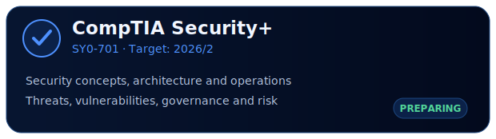
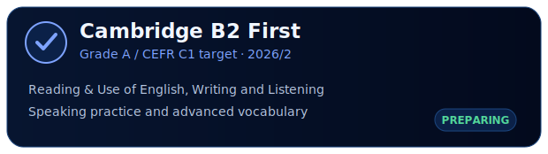

 

---

## About me

  I'm Iago Santana, a Computer Engineering undergraduate at CEFET-MG with experience in cybersecurity and secure software development. I work across SOC, CTI, Threat Hunting, Detection Engineering and AppSec, while also developing applications and technical solutions for real clients. 

  I also take part in scientific research and academic projects in computing, security and emerging technologies, building a career at the intersection of cyber defense, secure development and security research.

---

### Current academic and professional activities

- **SOC / CTI internship:** event investigation, detection analysis, rule tuning, MITRE ATT&CK mapping and technical documentation.
- **Undergraduate research:** security risks and attack surfaces in Large Language Models.
- **Post-Quantum Cryptography:** ECC foundations, cryptographic attacks and quantum-resistant approaches.
- **PET / COMPET:** participation in academic activities, collaborative initiatives and events at CEFET-MG.

---

## Career snapshot

| Period | Experience |
|---|---|
| **2024/1 — 2024/2** | Software Engineering undergraduate at **PUC-MG** |
| **2024/2 — present** | Computer Engineering undergraduate at **CEFET-MG** |
| **2026/1 — present** | Cybersecurity Intern in a **SOC / CTI** environment |
| **2026/1 — 2026/2** | Undergraduate researcher in **Post-Quantum Cryptography** |
| **2026/2 — present** | Undergraduate researcher in **Large Language Model Security** |

## Academic and technical projects

## Technical focus

  

  

---

## 2026/2 certification goals

  
  

---

## GitHub activity

  

<!-- This animation appears after the GitHub Actions workflow creates the output branch. -->
<picture>
  <source media="(prefers-color-scheme: dark)" srcset="https://raw.githubusercontent.com/santana-iago/santana-iago/output/github-contribution-grid-snake-dark.svg">
  <source media="(prefers-color-scheme: light)" srcset="https://raw.githubusercontent.com/santana-iago/santana-iago/output/github-contribution-grid-snake.svg">
  
</picture>

---

### Contact

Engineering systems, investigating threats and documenting what I learn.

