

  <strong><kbd>EN</kbd></strong>
  <a href="./README.pt-BR.md"><kbd>PT-BR</kbd></a>

<picture>
  <source media="(max-width: 480px)" srcset="./assets/generated/hero-mobile.svg">
  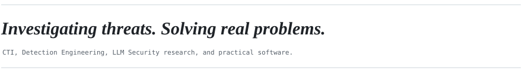
</picture>
<picture>
  <source media="(max-width: 480px)" srcset="./assets/generated/status-mobile.svg">
  
</picture>

 

<a href="https://www.linkedin.com/in/santana-iago/"><picture><source media="(max-width: 480px)" srcset="./assets/generated/contact-linkedin-mobile.svg"></picture></a>&#8195;&#8195;<a href="mailto:iagoss949@gmail.com"><picture><source media="(max-width: 480px)" srcset="./assets/generated/contact-email-mobile.svg"></picture></a>

<picture>
  <source media="(max-width: 480px)" srcset="./assets/generated/featured-header-mobile.svg">
  
</picture>

<picture><source media="(max-width: 480px)" srcset="./assets/generated/featured-card-0-mobile.svg">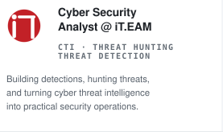</picture><picture><source media="(max-width: 480px)" srcset="./assets/generated/featured-card-1-mobile.svg">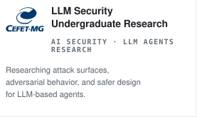</picture><a href="https://criptoescape.com"><picture><source media="(max-width: 480px)" srcset="./assets/generated/featured-card-2-mobile.svg">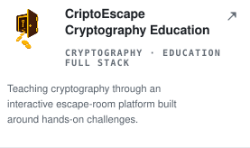</picture></a>

<picture>
  <source media="(max-width: 480px)" srcset="./assets/generated/current-header-mobile.svg">
  
</picture>

<picture><source media="(max-width: 480px)" srcset="./assets/generated/current-0-mobile.svg">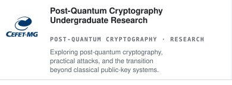</picture><picture><source media="(max-width: 480px)" srcset="./assets/generated/current-1-mobile.svg">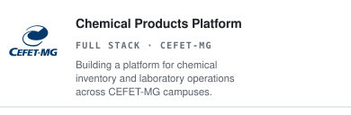</picture><picture><source media="(max-width: 480px)" srcset="./assets/generated/current-2-mobile.svg">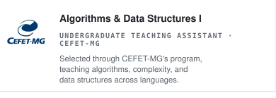</picture><picture><source media="(max-width: 480px)" srcset="./assets/generated/current-3-mobile.svg">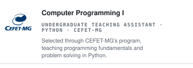</picture><picture><source media="(max-width: 480px)" srcset="./assets/generated/current-tmb-scan-mobile.svg">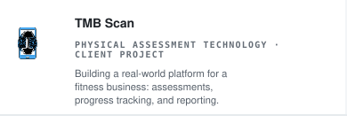</picture><a href="https://custodioveiculos.com.br"><picture><source media="(max-width: 480px)" srcset="./assets/generated/current-5-mobile.svg">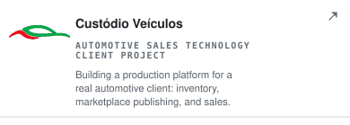</picture></a><picture><source media="(max-width: 480px)" srcset="./assets/generated/current-6-mobile.svg">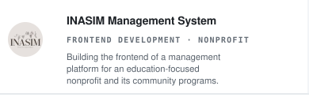</picture><a href="https://compet.vercel.app/"><picture><source media="(max-width: 480px)" srcset="./assets/generated/current-7-mobile.svg">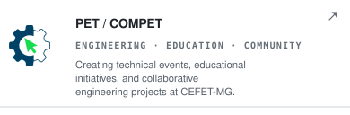</picture></a>

<picture>
  <source media="(max-width: 480px)" srcset="./assets/generated/certifications-header-mobile.svg">
  
</picture>

<picture><source media="(max-width: 480px)" srcset="./assets/generated/cert-0-mobile.svg"></picture><picture><source media="(max-width: 480px)" srcset="./assets/generated/cert-1-mobile.svg"></picture>

<picture>
  <source media="(max-width: 480px)" srcset="./assets/generated/statistics-header-mobile.svg">
  
</picture>

Accessible text version

## Featured work
### Cyber Security Analyst @ iT.EAM
*CTI · THREAT HUNTING · THREAT DETECTION*

Building detections, hunting threats, and turning cyber threat intelligence into practical security operations.

### LLM Security Undergraduate Research
*AI SECURITY · LLM AGENTS · RESEARCH*

Researching attack surfaces, adversarial behavior, and safer design for LLM-based agents.

### CriptoEscape
*CRYPTOGRAPHY · EDUCATION · FULL STACK*

Teaching cryptography through an interactive escape-room platform built around hands-on challenges.

## Other work
### Post-Quantum Cryptography Undergraduate Research
*POST-QUANTUM CRYPTOGRAPHY · RESEARCH*

Exploring post-quantum cryptography, practical attacks, and the transition beyond classical public-key systems.

### Chemical Products Platform
*FULL STACK · CEFET-MG*

Building a platform for chemical inventory and laboratory operations across CEFET-MG campuses.

### Algorithms & Data Structures I
*UNDERGRADUATE TEACHING ASSISTANT · CEFET-MG*

Selected through CEFET-MG's program, teaching algorithms, complexity, and data structures across languages.

### Computer Programming I
*UNDERGRADUATE TEACHING ASSISTANT · PYTHON · CEFET-MG*

Selected through CEFET-MG's program, teaching programming fundamentals and problem solving in Python.

### TMB Scan
*PHYSICAL ASSESSMENT TECHNOLOGY · CLIENT PROJECT*

Building a real-world platform for a fitness business: assessments, progress tracking, and reporting.

### [Custódio Veículos](https://custodioveiculos.com.br)
*AUTOMOTIVE SALES TECHNOLOGY · CLIENT PROJECT*

Building a production platform for a real automotive client: inventory, marketplace publishing, and sales.

### INASIM Management System
*FRONTEND DEVELOPMENT · NONPROFIT*

Building the frontend of a management platform for an education-focused nonprofit and its community programs.

### [PET / COMPET](https://compet.vercel.app/)
*ENGINEERING · EDUCATION · COMMUNITY*

Creating technical events, educational initiatives, and collaborative engineering projects at CEFET-MG.

## Certifications I'm pursuing
- [CompTIA Security+](https://assets.ctfassets.net/82ripq7fjls2/6TYWUym0Nudqa8nGEnegjG/0f9b974d3b1837fe85ab8e6553f4d623/CompTIA-Security-Plus-SY0-701-Exam-Objectives.pdf) — SY0-701 · Target: 2026/2 — **PREPARING**
- [Cambridge B2 First](https://www.cambridgeenglish.org/br/exams-and-tests/first/) — Grade A · CEFR C1 target · 2026/2 — **PREPARING**

<!-- Generated from profile.yml. Edit profile.yml, then run python scripts/build_profile.py. -->
