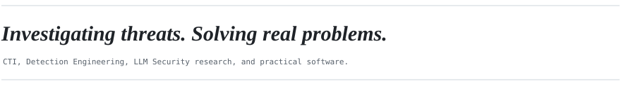
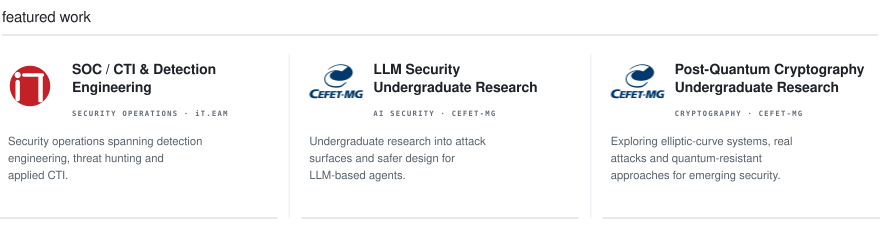
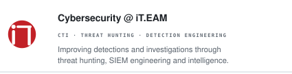
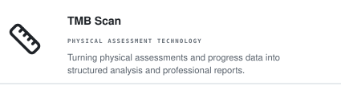
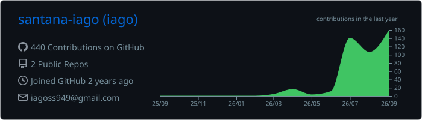

<picture>
  <source media="(max-width: 640px) and (prefers-color-scheme: dark)" srcset="./assets/generated/hero-mobile-dark.svg">
  <source media="(max-width: 640px)" srcset="./assets/generated/hero-mobile-light.svg">
  <source media="(prefers-color-scheme: dark)" srcset="./assets/generated/hero-desktop-dark.svg">
  
</picture>
<picture>
  <source media="(max-width: 640px) and (prefers-color-scheme: dark)" srcset="./assets/generated/status-mobile-dark.svg">
  <source media="(max-width: 640px)" srcset="./assets/generated/status-mobile-light.svg">
  <source media="(prefers-color-scheme: dark)" srcset="./assets/generated/status-desktop-dark.svg">
  
</picture>

 

<a href="https://www.linkedin.com/in/santana-iago/"><picture><source media="(max-width: 640px) and (prefers-color-scheme: dark)" srcset="./assets/generated/contact-linkedin-mobile-dark.svg"><source media="(max-width: 640px)" srcset="./assets/generated/contact-linkedin-mobile-light.svg"><source media="(prefers-color-scheme: dark)" srcset="./assets/generated/contact-linkedin-desktop-dark.svg"></picture></a>
<a href="mailto:iagoss949@gmail.com"><picture><source media="(max-width: 640px) and (prefers-color-scheme: dark)" srcset="./assets/generated/contact-email-mobile-dark.svg"><source media="(max-width: 640px)" srcset="./assets/generated/contact-email-mobile-light.svg"><source media="(prefers-color-scheme: dark)" srcset="./assets/generated/contact-email-desktop-dark.svg"></picture></a>
<a href="https://github.com/santana-iago"><picture><source media="(max-width: 640px) and (prefers-color-scheme: dark)" srcset="./assets/generated/contact-github-mobile-dark.svg"><source media="(max-width: 640px)" srcset="./assets/generated/contact-github-mobile-light.svg"><source media="(prefers-color-scheme: dark)" srcset="./assets/generated/contact-github-desktop-dark.svg"></picture></a>

<picture>
  <source media="(max-width: 640px) and (prefers-color-scheme: dark)" srcset="./assets/generated/featured-mobile-dark.svg">
  <source media="(max-width: 640px)" srcset="./assets/generated/featured-mobile-light.svg">
  <source media="(prefers-color-scheme: dark)" srcset="./assets/generated/featured-desktop-dark.svg">
  
</picture>

<picture>
  <source media="(max-width: 640px) and (prefers-color-scheme: dark)" srcset="./assets/generated/current-header-mobile-dark.svg">
  <source media="(max-width: 640px)" srcset="./assets/generated/current-header-mobile-light.svg">
  <source media="(prefers-color-scheme: dark)" srcset="./assets/generated/current-header-desktop-dark.svg">
  
</picture>

<picture><source media="(max-width: 640px) and (prefers-color-scheme: dark)" srcset="./assets/generated/current-0-mobile-dark.svg"><source media="(max-width: 640px)" srcset="./assets/generated/current-0-mobile-light.svg"><source media="(prefers-color-scheme: dark)" srcset="./assets/generated/current-0-desktop-dark.svg"></picture>
<picture><source media="(max-width: 640px) and (prefers-color-scheme: dark)" srcset="./assets/generated/current-1-mobile-dark.svg"><source media="(max-width: 640px)" srcset="./assets/generated/current-1-mobile-light.svg"><source media="(prefers-color-scheme: dark)" srcset="./assets/generated/current-1-desktop-dark.svg"></picture>
<a href="https://github.com/santana-iago/criptoescape"><picture><source media="(max-width: 640px) and (prefers-color-scheme: dark)" srcset="./assets/generated/current-2-mobile-dark.svg"><source media="(max-width: 640px)" srcset="./assets/generated/current-2-mobile-light.svg"><source media="(prefers-color-scheme: dark)" srcset="./assets/generated/current-2-desktop-dark.svg"></picture></a>
<picture><source media="(max-width: 640px) and (prefers-color-scheme: dark)" srcset="./assets/generated/current-3-mobile-dark.svg"><source media="(max-width: 640px)" srcset="./assets/generated/current-3-mobile-light.svg"><source media="(prefers-color-scheme: dark)" srcset="./assets/generated/current-3-desktop-dark.svg"></picture>
<picture><source media="(max-width: 640px) and (prefers-color-scheme: dark)" srcset="./assets/generated/current-4-mobile-dark.svg"><source media="(max-width: 640px)" srcset="./assets/generated/current-4-mobile-light.svg"><source media="(prefers-color-scheme: dark)" srcset="./assets/generated/current-4-desktop-dark.svg"></picture>
<a href="https://github.com/santana-iago/custodio-veiculos-site"><picture><source media="(max-width: 640px) and (prefers-color-scheme: dark)" srcset="./assets/generated/current-5-mobile-dark.svg"><source media="(max-width: 640px)" srcset="./assets/generated/current-5-mobile-light.svg"><source media="(prefers-color-scheme: dark)" srcset="./assets/generated/current-5-desktop-dark.svg"></picture></a>
<a href="https://compet.vercel.app/"><picture><source media="(max-width: 640px) and (prefers-color-scheme: dark)" srcset="./assets/generated/current-6-mobile-dark.svg"><source media="(max-width: 640px)" srcset="./assets/generated/current-6-mobile-light.svg"><source media="(prefers-color-scheme: dark)" srcset="./assets/generated/current-6-desktop-dark.svg"></picture></a>

<picture>
  <source media="(max-width: 640px) and (prefers-color-scheme: dark)" srcset="./assets/generated/certifications-header-mobile-dark.svg">
  <source media="(max-width: 640px)" srcset="./assets/generated/certifications-header-mobile-light.svg">
  <source media="(prefers-color-scheme: dark)" srcset="./assets/generated/certifications-header-desktop-dark.svg">
  
</picture>

<a href="https://assets.ctfassets.net/82ripq7fjls2/6TYWUym0Nudqa8nGEnegjG/0f9b974d3b1837fe85ab8e6553f4d623/CompTIA-Security-Plus-SY0-701-Exam-Objectives.pdf"><picture><source media="(max-width: 640px) and (prefers-color-scheme: dark)" srcset="./assets/generated/cert-0-mobile-dark.svg"><source media="(max-width: 640px)" srcset="./assets/generated/cert-0-mobile-light.svg"><source media="(prefers-color-scheme: dark)" srcset="./assets/generated/cert-0-desktop-dark.svg"></picture></a>
<a href="https://www.cambridgeenglish.org/br/exams-and-tests/first/"><picture><source media="(max-width: 640px) and (prefers-color-scheme: dark)" srcset="./assets/generated/cert-1-mobile-dark.svg"><source media="(max-width: 640px)" srcset="./assets/generated/cert-1-mobile-light.svg"><source media="(prefers-color-scheme: dark)" srcset="./assets/generated/cert-1-desktop-dark.svg"></picture></a>

<picture>
  <source media="(max-width: 640px) and (prefers-color-scheme: dark)" srcset="./assets/generated/statistics-header-mobile-dark.svg">
  <source media="(max-width: 640px)" srcset="./assets/generated/statistics-header-mobile-light.svg">
  <source media="(prefers-color-scheme: dark)" srcset="./assets/generated/statistics-header-desktop-dark.svg">
  
</picture>

Accessible text version

## Featured work
### SOC / CTI & Detection
*SECURITY OPERATIONS · iT.EAM*

Security operations spanning detection engineering, threat hunting and applied CTI.

### LLM Security Undergraduate Research
*AI SECURITY · CEFET-MG*

Undergraduate research into attack surfaces and safer design for LLM-based agents.

### Post-Quantum Cryptography Undergraduate Research
*CRYPTOGRAPHY · CEFET-MG*

Exploring elliptic-curve systems, real attacks and quantum-resistant approaches for emerging security.

## Currently working on
### Cybersecurity @ iT.EAM
*CTI · THREAT HUNTING · DETECTION ENGINEERING*

Improving detections and investigations through threat hunting, SIEM engineering and intelligence.

### LLM Security Undergraduate Research
*AI SECURITY · CEFET-MG*

Studying attack surfaces and defensive patterns for LLM agents, tools and MCP-based systems.

### [ECC Education & Outreach](https://github.com/santana-iago/criptoescape)
*CRYPTOGRAPHY EDUCATION · CEFET-MG*

Making elliptic-curve cryptography accessible through demonstrations and educational material.

### Chemical Products Platform
*LABORATORY MANAGEMENT · CEFET-MG*

Centralizing chemical inventory and laboratory operations across CEFET-MG campuses.

### TMB Scan
*PHYSICAL ASSESSMENT TECHNOLOGY*

Turning physical assessments and progress data into structured analysis and professional reports.

### [Custódio Veículos](https://github.com/santana-iago/custodio-veiculos-site)
*AUTOMOTIVE SALES TECHNOLOGY*

Managing vehicle sales, marketplace publishing and commercial performance in one platform.

### [PET / COMPET](https://compet.vercel.app/)
*TECHNOLOGY · EDUCATION · COMMUNITY*

Creating technical events, educational initiatives and collaborative engineering projects.

## Certifications
- [CompTIA Security+](https://assets.ctfassets.net/82ripq7fjls2/6TYWUym0Nudqa8nGEnegjG/0f9b974d3b1837fe85ab8e6553f4d623/CompTIA-Security-Plus-SY0-701-Exam-Objectives.pdf) — SY0-701 · Target: 2026/2 — **PREPARING**
- [Cambridge B2 First](https://www.cambridgeenglish.org/br/exams-and-tests/first/) — Grade A · CEFR C1 target · 2026/2 — **PREPARING**

<!-- Generated from profile.yml. Edit profile.yml, then run python scripts/build_profile.py. -->
