

  <a href="./README.md"><kbd>EN</kbd></a>
  <strong><kbd>PT-BR</kbd></strong>

<picture>
  <source media="(max-width: 480px)" srcset="./assets/generated/pt-BR/hero-mobile.svg">
  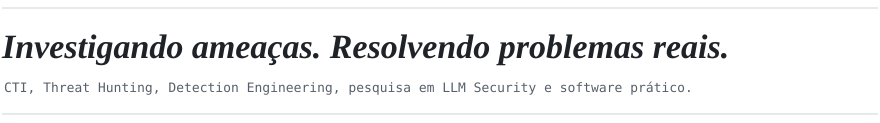
</picture>
<picture>
  <source media="(max-width: 480px)" srcset="./assets/generated/pt-BR/status-mobile.svg">
  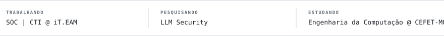
</picture>

 

<a href="https://www.linkedin.com/in/santana-iago/"><picture><source media="(max-width: 480px)" srcset="./assets/generated/pt-BR/contact-linkedin-mobile.svg"></picture></a>&#8195;&#8195;<a href="mailto:iagoss949@gmail.com"><picture><source media="(max-width: 480px)" srcset="./assets/generated/pt-BR/contact-email-mobile.svg"></picture></a>

<picture>
  <source media="(max-width: 480px)" srcset="./assets/generated/pt-BR/featured-header-mobile.svg">
  
</picture>

<picture><source media="(max-width: 480px)" srcset="./assets/generated/pt-BR/featured-card-0-mobile.svg">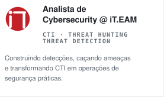</picture><picture><source media="(max-width: 480px)" srcset="./assets/generated/pt-BR/featured-card-1-mobile.svg">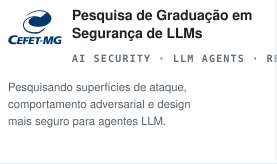</picture><a href="https://criptoescape.com"><picture><source media="(max-width: 480px)" srcset="./assets/generated/pt-BR/featured-card-2-mobile.svg">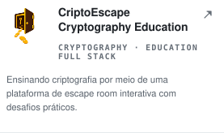</picture></a>

<picture>
  <source media="(max-width: 480px)" srcset="./assets/generated/pt-BR/current-header-mobile.svg">
  
</picture>

<picture><source media="(max-width: 480px)" srcset="./assets/generated/pt-BR/current-0-mobile.svg">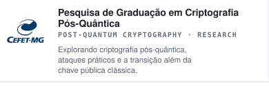</picture><picture><source media="(max-width: 480px)" srcset="./assets/generated/pt-BR/current-1-mobile.svg">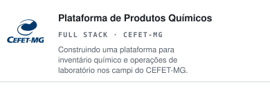</picture><picture><source media="(max-width: 480px)" srcset="./assets/generated/pt-BR/current-2-mobile.svg">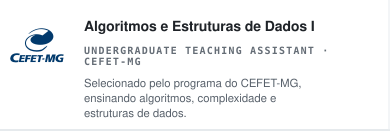</picture><picture><source media="(max-width: 480px)" srcset="./assets/generated/pt-BR/current-3-mobile.svg">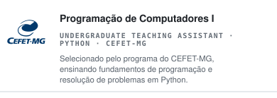</picture><picture><source media="(max-width: 480px)" srcset="./assets/generated/pt-BR/current-tmb-scan-mobile.svg">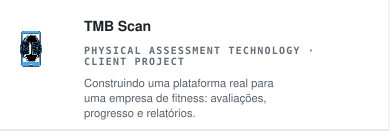</picture><a href="https://custodioveiculos.com.br"><picture><source media="(max-width: 480px)" srcset="./assets/generated/pt-BR/current-5-mobile.svg">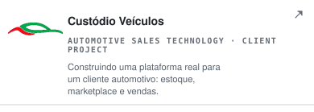</picture></a><picture><source media="(max-width: 480px)" srcset="./assets/generated/pt-BR/current-6-mobile.svg">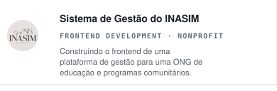</picture><a href="https://compet.vercel.app/"><picture><source media="(max-width: 480px)" srcset="./assets/generated/pt-BR/current-7-mobile.svg">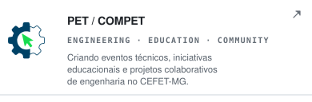</picture></a>

<picture>
  <source media="(max-width: 480px)" srcset="./assets/generated/pt-BR/certifications-header-mobile.svg">
  
</picture>

<picture><source media="(max-width: 480px)" srcset="./assets/generated/pt-BR/cert-0-mobile.svg"></picture><picture><source media="(max-width: 480px)" srcset="./assets/generated/pt-BR/cert-1-mobile.svg"></picture>

<picture>
  <source media="(max-width: 480px)" srcset="./assets/generated/pt-BR/statistics-header-mobile.svg">
  
</picture>

Versão em texto acessível

## Trabalhos em destaque
### Analista de Cybersecurity @ iT.EAM
*CTI · THREAT HUNTING · THREAT DETECTION*

Construindo detecções, caçando ameaças e transformando CTI em operações de segurança práticas.

### Pesquisa de Graduação em Segurança de LLMs
*AI SECURITY · LLM AGENTS · RESEARCH*

Pesquisando superfícies de ataque, comportamento adversarial e design mais seguro para agentes LLM.

### CriptoEscape
*CRYPTOGRAPHY · EDUCATION · FULL STACK*

Ensinando criptografia por meio de uma plataforma de escape room interativa com desafios práticos.

## Outros trabalhos
### Pesquisa de Graduação em Criptografia Pós-Quântica
*POST-QUANTUM CRYPTOGRAPHY · RESEARCH*

Explorando criptografia pós-quântica, ataques práticos e a transição além da chave pública clássica.

### Plataforma de Produtos Químicos
*FULL STACK · CEFET-MG*

Construindo uma plataforma para inventário químico e operações de laboratório nos campi do CEFET-MG.

### Algoritmos e Estruturas de Dados I
*UNDERGRADUATE TEACHING ASSISTANT · CEFET-MG*

Selecionado pelo programa do CEFET-MG, ensinando algoritmos, complexidade e estruturas de dados.

### Programação de Computadores I
*UNDERGRADUATE TEACHING ASSISTANT · PYTHON · CEFET-MG*

Selecionado pelo programa do CEFET-MG, ensinando fundamentos de programação e resolução de problemas em Python.

### TMB Scan
*PHYSICAL ASSESSMENT TECHNOLOGY · CLIENT PROJECT*

Construindo uma plataforma real para uma empresa de fitness: avaliações, progresso e relatórios.

### [Custódio Veículos](https://custodioveiculos.com.br)
*AUTOMOTIVE SALES TECHNOLOGY · CLIENT PROJECT*

Construindo uma plataforma real para um cliente automotivo: estoque, marketplace e vendas.

### Sistema de Gestão do INASIM
*FRONTEND DEVELOPMENT · NONPROFIT*

Construindo o frontend de uma plataforma de gestão para uma ONG de educação e programas comunitários.

### [PET / COMPET](https://compet.vercel.app/)
*ENGINEERING · EDUCATION · COMMUNITY*

Criando eventos técnicos, iniciativas educacionais e projetos colaborativos de engenharia no CEFET-MG.

## Certificações em andamento
- [CompTIA Security+](https://assets.ctfassets.net/82ripq7fjls2/6TYWUym0Nudqa8nGEnegjG/0f9b974d3b1837fe85ab8e6553f4d623/CompTIA-Security-Plus-SY0-701-Exam-Objectives.pdf) — SY0-701 · Target: 2026/2 — **EM PREPARAÇÃO**
- [Cambridge B2 First](https://www.cambridgeenglish.org/br/exams-and-tests/first/) — Grade A · CEFR C1 target · 2026/2 — **EM PREPARAÇÃO**

<!-- Gerado a partir de profile.yml e profile.pt-BR.yml. Edite esses arquivos e rode python scripts/build_profile.py. -->
